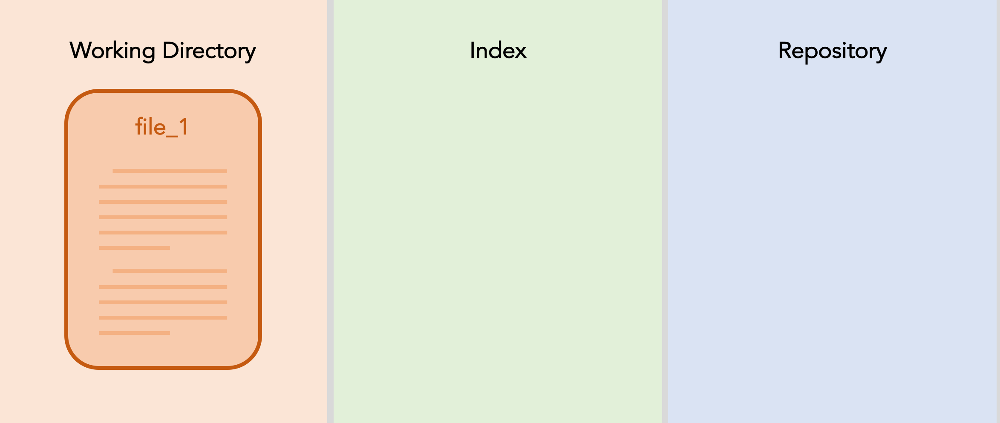
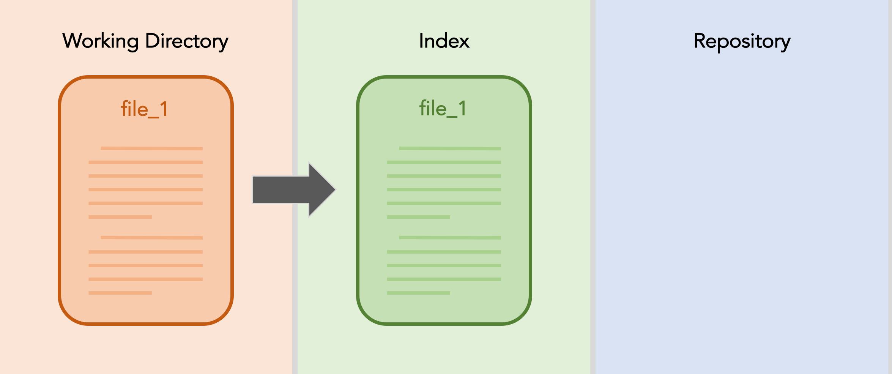
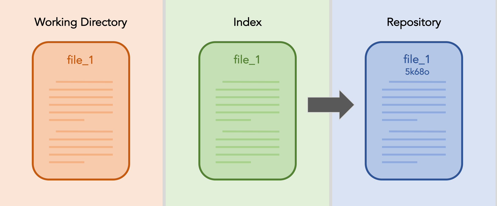
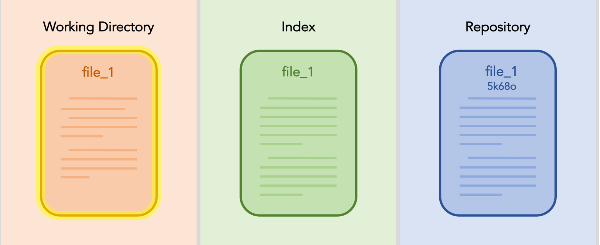
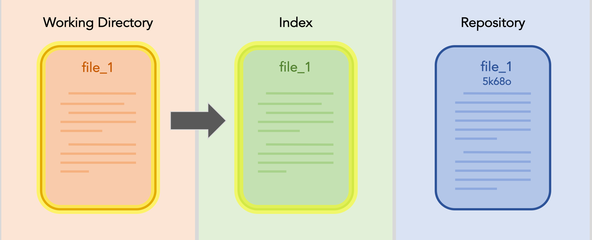
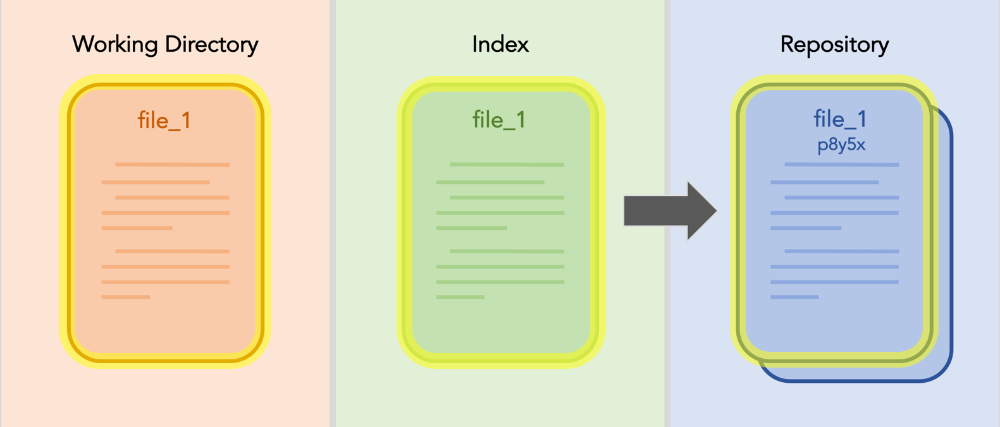
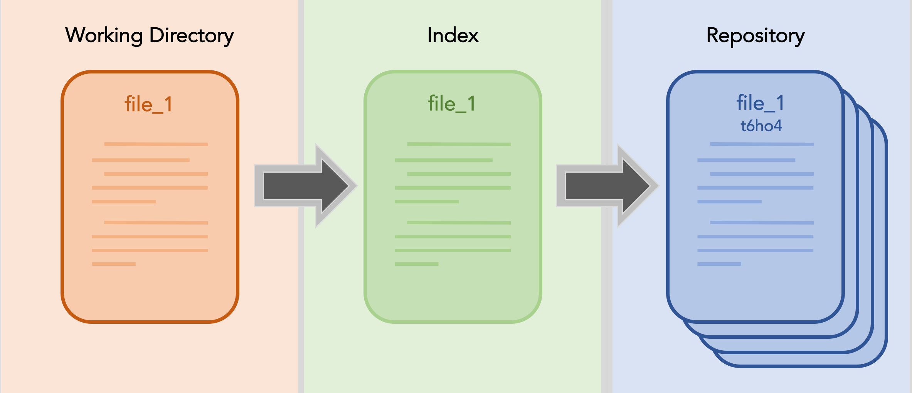

If you don't have git installed:
- [Download for Windows (includes bash & git)](https://git-for-windows.github.io/)
- [Download for Mac OS X](https://git-scm.com/download/mac)
- Linux: `sudo apt-get install git`

# Git this

## What happens when you don't use version control?

### A general life example:


You most likely started out doing something like this. Maybe you've become more sophisticated (or not) and now you

* date files
* append `_vXXX`

This is good, but you can still do better. 

## Why version control is amazing
* Code that works will be saved permanently
* If you break the code that works, reverting is easy
* You still only need to keep one version around (the VC program does the rest)
* Collaboration is kept smooth and coordinated
* Productivity is not stifled by too many people working on one document


## Git

[Git](https://git-scm.com/) is the method of version control we're going to be working with. Other methods exist (SVN and Mercurial are the big names, and Wikipedia's [page history](https://en.wikipedia.org/w/index.php?title=List_of_version_control_software&action=history) is a more commonly known example).

Git tracks your files by essentially taking a snapshot of a directory or subdirectory structure and saving it over time. The process of capturing one of these processes is called a commit.

To be a little more specific, you can think of Git as working in three different areas or bins. There is (1) the workspace, (2) the repository, and (3) the index. 

#### Workspace: 
The set of directories and files that you actually operate on.

#### Repository (repo)
The set of linked commits corresponding to snapshots of the workspace at specified points in time.

#### Index
The staging area where you "set up your snapshot"; files in the index that have changed since your last commit will be updated on your next commit.

### Hashes
Each commit is given a unique label (called a hash) and is tied to the previous commit. This is created using a function which converts a set of information (i.e. your docs) into a string of letters and numbers. Hashes include a layer of security, since each relies on its parent's hash.

### Diagramatic Representation
Below is a diagram of the git process for a single file; I've named it file_1. You start by creating the file in your workspace. 



Once you are satisfied with it's progress, you decide that you want to commit your work. You add the file to the index. 



Now you're ready. You can commit the file to your repository. (Notice that in the repository file_1 is shown with the hash of the commit. In reality the full hash for a git commit is much longer.)



Now, if you make some changes to file_1. Your workspace changes. 



You add the changed file_1 to the index.



And again, you finally you commit. The new commit replaces the most recent commit, which moves deeper into the repository's history.



And the process repeats, on and on, continually building up your repository's history.



## Your turn to Git started

First we want to make a directory to track as the repository for this tutorial. Go somewhere in your file system and create this directory. Then navigate inside the newly created directory. (In the following code snippets, a \$ indicates a command line prompt.)

```
$ mkdir git_tutorial
$ cd git_tutorial
```

Once you're inside, its time to initialize the repository. Intuitively, this is done with the command

```
$ git init 
```

Now, since this is likely the first time you're creating a Git repo, you may want to set up some Git configurations. Feel free to skip this step (it is optional) but if you don't do it now, Git will likely ask you for this information repeatedly in the future.

```
$ git config --global user.name "OskiBear"
$ git config --global user.email "oski@berkeley.edu"
$ git config --global core.editor /usr/bin/nano
```
Don't worry, you can change this information later. It is stored in the hidden `.git/config` file that appears in whichever directory you ran `git init`. You can also use `git config --list` to print all of the configuration options for easy viewing.

If you already have a GitHub account, it is best to use the same username and email for both Git and that account. Additionally, if you have a preffered editor (vim, emacs, sublime, etc.), feel free to use that instead of nano as your default.

First off, we'll make a very simple program. Open a new file called `hello.sh` and add the following inside:

```
echo "Hello, World!" > hello.txt
``` 
Save the script, and exit the text editor.

We can now see the options that Git provides by using just the `git` command, with no options or arguments. It should show the git usage statement, providing descriptions of the most commonly used git commands.

At this point we will follow the steps outlined above. First, we will add our new file to the index, as we prepare to save a snapshot of it to our repository. This is straightforward enough, the command is 

```
$ git add hello.sh
```
If all goes well, nothing should be displayed on the console. If you want to check that your change was added to the index, type

```
$ git status
```

Git should then let you know that a new file, `hello.sh` has been staged, and is ready to be committed. When you are ready, commit the changes with the `git commit` command. Adding the `-m` option allows you to give a short message explaining the changes.

```
$ git commit -m "created a new repository containing a simple script"
```

Let's keep practicing. Now make another slightly more interesting program. This is a python script to use Monte Carlo rejection sampling to determine the value of $\pi$. Open a file called picalc.py and include the following code inside. 

```
import numpy as np

N = 1000
X = np.random.random(N)
Y = np.random.random(N)

scores = []
noscores = []
for n in range(N):
	x,y = X[n],Y[n]
	if x**2 + y**2 < 1:
		scores.append([x,y])
	else:
		noscores.append([x,y])
	if n%10 == 0:
		print(4*len(scores)/(len(scores)+len(noscores)))
```

Again, save and exit the editor, and now follow the same steps as before. First, add the new file; then, commit the changes and include a brief message.

## Let's Git a bit more complicated
At this point, our repository is starting to get interesting. We can see how things are evolving in our repo with the command

```
$ git log
```
You will see a history of each commit, from the most recent commit at the top to the oldest commit at the bottom.

Open picalc.py in an editor once again and change the script by adding the following lines: 

* Below `import numpy as np` add

	```
	from matplotlib import pyplot as plt
	```
* At the bottom of the program, add (unindented)

	```
	scores = np.asarray(scores)
	noscores = np.asarray(noscores)
	plt.plot(scores[:,0], scores[:,1], 'bo', noscores[:,0], noscores[:,1], 'ro')
	plt.show()
	
	```
	
Save the script and exit the editor. Now, the version of picalc.py in our working directory is different than the version in the index (and by extension, in the repo). We can see the changes quickly by typing

```
$ git diff
```
on the command line.

Now, we're going to take things even further. The really powerful parts of Git are used when two people are collaborating on a project (or when you are trying to multitask–working on two aspects of a single project independently from one another).

To see this, we are going to have you "break" one of your programs. To solve the issue, you are going to create a new branch where you go back and correct the problem. Now, the branch with the fix will be different from the original. When you try to bring the branches back together, to the original "master" branch, the changes will conflict, and you will be able to merge the changes. (If the changes didn't conflict, for example if you just added an extra line of code, Git is smart enough to notice this fact and merge the documents automatically. 


<Create a diagram to show/explain the following procedure>

Open the `hello.sh` script and change the echo statement to be more like the original "hello, world" scripts

```
echo `hello, world` > hello.txt
```

Since we haven't created a new file here, we can use a handy shortcut to avoid having to type both `git add` and `git commit`. Type

```
$ git commit -am "message of your choice"
```

The new option `-a` adds all modified documents to the index automatically before the commit is enacted.

Now, if you run the program again, the file `hello.txt` now contains the statement in all lowercase.

Since this is improper English, we decide to change the shell script back to the way it was before. This time though, we're going to work on a new branch. Creating a new branch allows us to make changes to the code, including as many commits as we'd like, without actually modifying the original "master branch" of the code. Let's try it.

```
$ git checkout -b englishfix
```
The git checkout statement allows you to extract files and branches from the repository. Since our branch had not already been created, we needed to use the `-b` option. If the englishfix branch already existed, we could omit the `-b`.

Now we are on the `englishfix` branch. Let's go ahead and fix the script, changing `hello, world` to `Hello, World`. Commit the changes. Now, if you use `git checkout master` (master is automatically named when you use `git init`) and look at the script (type `cat hello.txt`) you will see that your changes on the englishfix branch were not transferred. This is super useful if you have a working version of a piece of code and want to add a new feature without taking the risk of breaking your code in the meantime.

What if you had been working on the script in the meantime? Still on the master branch, open the script, and add the exclamation point back in. Change "hello, world" to "hello, world!", save and exit the editor.

Now, since we _did_ want to incorporate the changes on the englishfix branch into the master branch, we should merge the englishfix branch into the master branch. Type

```
git merge englishfix
```

You should get an error (which includes a culprit file). Even though git is usually smart enough to perform automatic merges, when a line of code is edited two different ways on two different branches, it doesn't know what to make of the situation. This best solution, give it back to a human and let them make some sense out of it.

To resolve the conflict, use `git diff` to have the differences between the conflicting documents printed to the console, and then use an editor to fix the discrepancy. Finally, add and commit the changes, and then the merge is complete!

<Find image of Git repo as tree to emphasize branched nature>

## Bonus!

### Configurations

As we mentioned earlier, you can manually edit the configuration file to update your Git settings. To do this, move to your home directory and open the file `.gitconfig`. 


### .gitignore

You can also tell git to ignore specific files by adding them to a .gitignore file. Find (or create) this file as `.gitignore` in the top level of the repo where you want it to apply.

Note you can use wildcards in these filenames! (i.e. `*.log` will ignore all files ending in `.log`)

Other things:

```
git checkout
git stash 
git reset
git rebase
gitk
```

## Git Cheat Sheet

You can often think of the operations that Git performs on the three "areas"–workspace, index, and repo–as mathematical equations. Here are some examples (for each Git command, perform the steps in order):

##### git add
$ \text{staged index} = \text{workspace} - \text{current branch} $

##### git commit
(with `-a` option: $ \text{staged index} = \text{workspace} - \text{current branch} $)
$ \text{new commit} = \text{staged index} $
$ \text{current branch} = \text{new commit} $
$ \text{staged index} = 0 $

##### git checkout
$ \text{new workspace} = \left(\text{workspace} - \text{old branch}\right) + \text{new branch} $

##### git stash
$ \text{stash} = \text{workspace} - \text{current branch} $
$ \text{workspace} = \text{current branch} $

##### git reset --hard
$ \text{workspace} = \text{current branch} $
